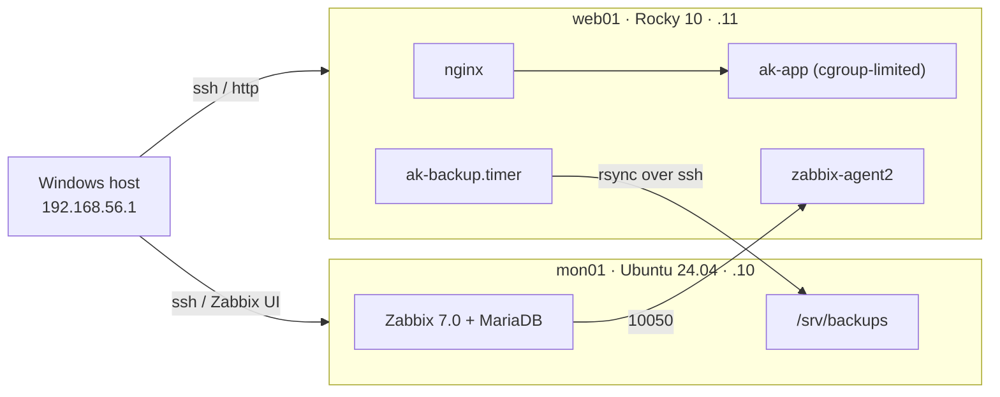

# ak-infra-lab: a hardened, monitored, backed-up Linux mini fleet

> *Built and operated a 2-node Linux lab (Rocky Linux 10, Ubuntu 24.04) in VirtualBox: role-based users and sudo, LVM storage with online extension, systemd services with cgroup limits, SSH/firewalld/SELinux hardening, and systemd-timer backups with verified restores; monitored it with Zabbix 7.0 using custom Bash/Python checks and alert triggers.*

**Status:** 🟢 **v1.0 + E1 complete** (2026-10-02). The automated test suite shows **23 PASS, 0 FAIL, 0 SKIP**, and the alert test T10 is recorded. Next: patching with change records and injected incidents ([roadmap](#roadmap)).

| Component | Version |
|---|---|
| Host | Windows 11 laptop (i3-1115G4, 8 GB), VirtualBox **7.2.20** |
| web01 | Rocky Linux **10.2**, kernel 6.12.0-211.61.1, nginx 1.26.3, zabbix-agent2 7.0.31 |
| mon01 | Ubuntu Server **24.04.5 LTS**, kernel 6.8.0-146, Zabbix server/frontend **7.0.31 LTS**, MariaDB 10.11.14 |

## What it is

This is two VMs run the way an L1/L2 team runs production:

- **web01** (Rocky Linux 10) serves a website and a small app behind nginx. SELinux is enforcing, firewalld splits a management zone from a public zone, and app data sits on LVM.
- **mon01** (Ubuntu 24.04) is the ops server. It runs Zabbix 7.0, receives the nightly backups and, in E1, collects web01's logs centrally.

The lab is then broken on purpose and fixed, and every incident gets a written report.

| Area | What was done | Proof |
|---|---|---|
| Access | `ops`/`devs` groups, scoped sudo, key-only SSH, no root login | T01–T03, T19 |
| Network | firewalld `mgmt` (ssh, http, 10050 from 192.168.56.0/24) vs `public` (http only); ufw on mon01 | T06, T16, T17 |
| Storage | LVM `vg_data/lv_app` (XFS), mounted by UUID, grown online with `lvextend -r` | T07 |
| Services | `ak-app.service` with `MemoryMax`, `CPUQuota`, `TasksMax` and sandboxing | T08 |
| SELinux | Custom file contexts and a boolean; the nginx 502 fixed without disabling SELinux | T04, INC-001 |
| Monitoring | Zabbix 7.0 with a custom template: health, backup age, memory, nginx | T09, T10 |
| Backup | tar (ACLs, xattrs, SELinux) + sha256 → rsync over SSH, systemd timer, tested restore | T11, T12a, T12b |
| Health | `healthcheck.sh` (Bash) and `procstat.py` (reads `/proc`) | T15 |

## Architecture



Details: [docs/architecture.md](docs/architecture.md) · IPs, users and ports: [docs/ip-plan.md](docs/ip-plan.md).

| Node | OS | IP (host-only) | RAM | Role |
|---|---|---|---|---|
| mon01 | Ubuntu Server 24.04 LTS | 192.168.56.10 | 2 GB | Zabbix server + UI, backup target, central log receiver, Ansible control (E3) |
| web01 | Rocky Linux 10 | 192.168.56.11 | 1.5 GB | nginx + ak-app, LVM data volume, zabbix-agent2, backup client |

## Verification

`tests/verify.sh` (run on mon01, 2026-10-02): **23 PASS, 0 FAIL, 0 SKIP**, covering T01–T20 (v1.0 + E1). T10 (alerting) is manual and passed: "nginx is down on web01" was raised and resolved within 1 minute ([screenshots](docs/screenshots/)). Per-test evidence with real output is in [tests/test-plan.md](tests/test-plan.md).

Highlights:
- **Online LVM extension:** `/srv/app` grew from 3.0 to 5.0 GB with `lvextend -r` while a request loop from mon01 got 60/60 `200` responses.
- **SELinux stays enforcing:** the nginx → app 502 was fixed with the narrowest boolean (`httpd_can_network_relay`), not `setenforce 0` ([INC-001](docs/incidents/INC-001-nginx-502-selinux.md)).
- **Backups are proven:** a nightly tar archive (ACLs, xattrs, SELinux labels) plus sha256 is sent to mon01. The restore test matches both file content and SELinux label, and Zabbix alerts if the last backup is older than 25 h.
- **Least privilege:** there's no root or password SSH (key only, `AllowGroups`). `akdev` may only restart nginx and read its journal. Root is reachable only through the `ops` group.
- **The firewall really splits zones:** SSH from the labnet side is refused (T16) while HTTP works (T17).
- **Accountable root (E1):** auditd records account, sudoers and sshd changes, and every root command, against the human login (`auid=akadmin`) even through sudo (T13).
- **Central logs (E1):** web01 forwards syslog over TCP 20514 to mon01 (SELinux port label checked first), with per-host files and logrotate (T14).
- **Backup key can't open a shell (E1):** web01's key on mon01 is forced to `rrsync -wo /srv/backups/web01`; a shell attempt is refused, backups still run.
- **Every listening port is explained** ([IP plan](docs/ip-plan.md#listening-ports-e15-review-2026-10-02-ss--tuln)); the review found and disabled an unneeded snmpd pulled in by Zabbix.

## Lessons from the build

Real problems hit along the way, each fixed and written into the guide:
- **SELinux 502 on the reverse proxy** → [INC-001](docs/incidents/INC-001-nginx-502-selinux.md).
- **Disk names changed** after a second disk was added (`sdb` became `sdc`). `/srv/app` still mounted, because fstab uses the UUID.
- **zabbix-server wasn't enabled at boot.** It ran fine until the reboot test exposed it.
- **The laptop's sleep paused the VMs**, leaving both clocks 9 h 15 min slow. chrony now uses `makestep 1 -1`.
- **kdump failed on a 1.5 GB VM** (no crashkernel reservation), so it was disabled and the reservation removed.
- **Test bugs, not system bugs:** a buffered sudo prompt and a `pipefail` + `grep -q` SIGPIPE gave false failures until fixed ([details](tests/test-plan.md#evidence)).
- **VirtualBox 7.2 quirks:** the wizard's unattended install created the wrong user and no LVM, a live snapshot hung (now always offline), and the host-only adapter disappeared and had to be recreated.

## Incidents

| ID | What broke | Write-up |
|---|---|---|
| INC-001 | nginx → app 502 under SELinux (natural, M2) | [INC-001](docs/incidents/INC-001-nginx-502-selinux.md) |
| INC-002 | /srv/app at 95%: a hidden 4.6 GB temp file; proven safe to delete (`lsof`, content, auditd) instead of growing the LV (blind, E2) | [INC-002](docs/incidents/INC-002-disk-full-hidden-tempfile.md) |
| INC-004 | Site down: nginx won't start after a config edit; one missing `;`, found with `nginx -t`, `diff` against the repo and auditd (blind, E2) | [INC-004](docs/incidents/INC-004-nginx-config-missing-semicolon.md) |
| INC-006 | Site unreachable from the mgmt network: `http` removed from the firewalld `mgmt` zone (runtime + permanent); **Zabbix stayed green**, because its check runs on the box (blind, E2) | [INC-006](docs/incidents/INC-006-firewalld-mgmt-http-removed.md) |

Catalog of all planned incidents: [docs/incidents/README.md](docs/incidents/README.md).

## Repository layout

```
docs/            build guide, requirements, IP plan, architecture, ADRs, runbooks, changes, incidents
configs/         config files per node (common / web01 / mon01 / windows)
scripts/         healthcheck.sh, ak-backup.sh, ak-backup-age.sh, procstat.py
systemd/         ak-app.service, ak-backup.service/.timer, ak-health.service/.timer
zabbix/          agent UserParameters + template spec (and the real template export)
tests/           test plan T01–T20, verify.sh + per-node checks
tools/           preflight.ps1 (host check), sync-to-lab.ps1, ak-chaos.sh (blind fault injector)
ansible/         E3: inventory, site.yml, roles
```

## Rebuild it

Follow [docs/build-guide.md](docs/build-guide.md) from M0. In short:
1. Windows: run `tools/preflight.ps1`, install VirtualBox 7.2 with its machine folder on D:, and create the `labnet` NAT network and the host-only network.
2. Install mon01 (Ubuntu 24.04) and web01 (Rocky 10 Minimal) with the IPs above.
3. `tools/sync-to-lab.ps1` copies this repo to both VMs. Install the configs as the guide describes (or run `ansible-playbook ansible/site.yml` once E3 is done).
4. On mon01: `bash tests/verify.sh` must show 0 FAIL.

## Roadmap

- ~~**E1:** auditd, sysctl hardening, central rsyslog, password aging, locked-down backup key~~ ✅ done 2026-10-02
- **E2:** patching with change records, 8 injected incidents with RCAs
- **E3:** Ansible rebuild (second run `changed=0`)
- **E4:** cgroup/namespace demos, performance baselines, NFS + autofs
- **E5:** Zabbix 7.0 → 8.0 upgrade once 8.0 is GA
