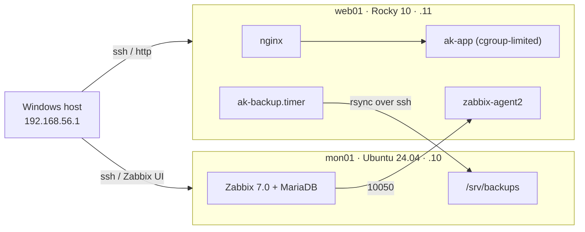

# ak-infra-lab: a hardened, monitored, backed-up Linux mini fleet

> **Target resume line (v1.0; use it only once it's true):**
> *Built and operated a 2-node Linux lab (Rocky Linux 10, Ubuntu 24.04) in VirtualBox: role-based users and sudo, LVM storage with online extension, systemd services with cgroup limits, SSH/firewalld/SELinux hardening, and systemd-timer backups with verified restores; monitored it with Zabbix 7.0 using custom Bash/Python checks and alert triggers.*

**Status:** 🟡 planned. The build hasn't started ([build guide](docs/build-guide.md)).
**Versions:** VirtualBox `7.2.x` · Rocky Linux `10.x` · Ubuntu Server `24.04.x` · Zabbix `7.0.x LTS` *(fill in the exact versions you used)*

## What it is

This is two VMs run the way an L1/L2 team runs production:

- **web01** (Rocky Linux 10) serves a website and a small app behind nginx. SELinux is enforcing, firewalld splits a management zone from a public zone, and app data sits on LVM.
- **mon01** (Ubuntu 24.04) is the ops server. It runs Zabbix 7.0, receives the nightly backups and, in E1, collects the central logs.

The lab is then broken on purpose and fixed, and every incident gets a written report.

| Area | What was done | Proof |
|---|---|---|
| Access | `ops`/`devs` groups, scoped sudo, key-only SSH, no root login | T01–T03, T19 |
| Network | firewalld `mgmt` (ssh, http, 10050 from 192.168.56.0/24) vs `public` (http only); ufw on mon01 | T06, T16, T17 |
| Storage | LVM `vg_data/lv_app` (XFS), mounted by UUID, grown online with `lvextend -r` | T07 |
| Services | `ak-app.service` with `MemoryMax`, `CPUQuota`, `TasksMax` and sandboxing | T08 |
| SELinux | Custom file contexts and a boolean; the nginx 502 fixed without disabling SELinux | T04, INC-001 |
| Monitoring | Zabbix 7.0 with a custom template: health, backup age, memory, nginx | T09, T10 |
| Backup | tar (ACLs, xattrs, SELinux) + sha256 → rsync over SSH, systemd timer, tested restore | T11, T12a, T12b |
| Health | `healthcheck.sh` (Bash) and `procstat.py` (reads `/proc`) | T15 |

## Architecture



Details: [docs/architecture.md](docs/architecture.md) · IPs, users and ports: [docs/ip-plan.md](docs/ip-plan.md).

| Node | OS | IP (host-only) | RAM | Role |
|---|---|---|---|---|
| mon01 | Ubuntu Server 24.04 LTS | 192.168.56.10 | 2 GB | Zabbix server + UI, backup target, log receiver (E1), Ansible control (E3) |
| web01 | Rocky Linux 10 | 192.168.56.11 | 1.5 GB | nginx + ak-app, LVM data volume, zabbix-agent2, backup client |

## Verification

*Not run yet.* After M4, paste the `tests/verify.sh` summary line here, e.g. "18 PASS, 0 FAIL, 3 SKIP (E1 tests)". Results with evidence go in [tests/test-plan.md](tests/test-plan.md).

## Incidents

| ID | What broke | Write-up |
|---|---|---|
| INC-001 | nginx → app 502 under SELinux (natural, M2) | *to do* |

Catalog of all planned incidents: [docs/incidents/README.md](docs/incidents/README.md).

## Repository layout

```
docs/            build guide, requirements, IP plan, architecture, ADRs, runbooks, changes, incidents
configs/         config files per node (common / web01 / mon01 / windows)
scripts/         healthcheck.sh, ak-backup.sh, ak-backup-age.sh, procstat.py
systemd/         ak-app.service, ak-backup.service/.timer, ak-health.service/.timer
zabbix/          agent UserParameters + template spec (and the real template export)
tests/           test plan T01–T20, verify.sh + per-node checks
tools/           preflight.ps1 (host check), sync-to-lab.ps1, ak-chaos.sh (blind fault injector)
ansible/         E3: inventory, site.yml, roles
```

## Rebuild it

Follow [docs/build-guide.md](docs/build-guide.md) from M0. In short:
1. Windows: run `tools/preflight.ps1`, install VirtualBox 7.2 with its machine folder on D:, and create the `labnet` NAT network and the host-only network.
2. Install mon01 (Ubuntu 24.04) and web01 (Rocky 10 Minimal) with the IPs above.
3. `tools/sync-to-lab.ps1` copies this repo to both VMs. Install the configs as the guide describes (or run `ansible-playbook ansible/site.yml` once E3 is done).
4. On mon01: `bash tests/verify.sh` must show 0 FAIL.

## Roadmap

- **E1:** auditd, sysctl hardening, central rsyslog, password aging, locked-down backup key
- **E2:** patching with change records, 8 injected incidents with RCAs
- **E3:** Ansible rebuild (second run `changed=0`)
- **E4:** cgroup/namespace demos, performance baselines, NFS + autofs
- **E5:** Zabbix 7.0 → 8.0 upgrade once 8.0 is GA
