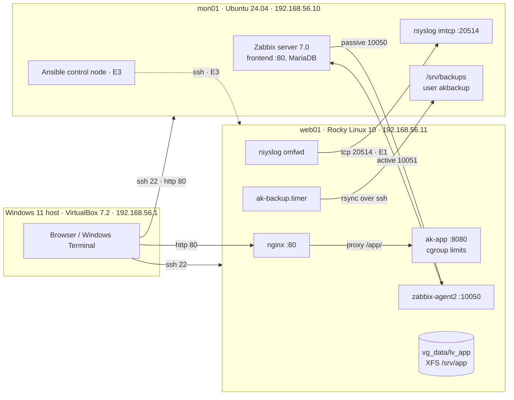

# Architecture

## Diagram



Plain-text version:

```
                 Windows 11 host (VirtualBox 7.2.x)  - browser -> Zabbix UI, SSH client
                          | 192.168.56.1 (host-only: management plane)
   ------------------------------------------------------------------
   |                                        |
+-----------------------+          +---------------------------+
| mon01 (Ubuntu 24.04)  |          | web01 (Rocky Linux 10)    |
| 192.168.56.10         |          | 192.168.56.11             |
| zabbix-server :10051  |<---------| zabbix-agent2 :10050      |
| zabbix web UI :80     |--------->|  (passive checks)         |
| rsyslog imtcp :20514  |<---------| rsyslog omfwd (E1)        |
| /srv/backups (akbackup)|<--------| ak-backup.timer 01:30     |
| ansible (E3)          |--------->| nginx :80 -> ak-app :8080 |
+-----------------------+          +---------------------------+
   \________ NAT Network "labnet" 10.0.10.0/24 (internet for dnf/apt) ________/
```

## Data flows

- **Metrics.** Zabbix agent 2 on web01 answers the server's passive checks on 10050/tcp. The "Linux by Zabbix agent" template supplies CPU, memory, disk and network metrics. The custom "AK Linux Lab" template adds `ak.health.status` (healthcheck.sh exit code), `ak.backup.age` (seconds since the last good backup), `ak.mem.avail_pct` (procstat.py) and `net.tcp.service[http,,80]`.
- **Logs (E1).** journald hands messages to rsyslog on web01, which forwards them over TCP to mon01. mon01 writes them to `/var/log/remote/<host>/<program>.log`, rotated daily and kept 14 days. A disk-assisted queue holds messages while mon01 is down. auditd events stay local on web01 (`ausearch`).
- **Backups.** Every night at 01:30 (±10 min, and at the next boot if missed) `ak-backup.timer` builds a tar archive of `/etc`, `/srv/www` and `/srv/app`, keeping ACLs, xattrs and SELinux labels. A sha256 file goes with it, and both are pushed with rsync over SSH to `akbackup@mon01`. The script records the success time. Zabbix raises an alert once that time is older than 25 h.
- **Administration.** SSH is key-only, root login is off, and access is limited to the `ops`, `devs` and `akbackup` groups. Config files live in this repo on Windows. [`tools/sync-to-lab.ps1`](../tools/sync-to-lab.ps1) copies them to `~/ak-infra-lab` on each VM, and they're installed from there (by hand in M1–M3, by Ansible in E3).
- **Change and incident records.** Every patch run gets a change record in [`docs/changes/`](changes/), and every incident, natural or injected, gets a report in [`docs/incidents/`](incidents/).

## Security layers on web01

| Layer | Control |
|---|---|
| Network | firewalld: the `mgmt` zone (source 192.168.56.0/24) allows ssh, http and 10050; `public` allows http only |
| Access | SSH keys only, no root login, `AllowGroups`, `MaxAuthTries 3`; sudo scoped per group |
| Mandatory access control | SELinux enforcing; file contexts and booleans are fixed properly, never by `setenforce 0` |
| Service | ak-app runs as `akapp` with `MemoryMax`, `CPUQuota`, `TasksMax`, `NoNewPrivileges` and `ProtectSystem=strict` |
| Audit (E1) | auditd watches identity files, sudoers and the sshd config, plus every root command run by a logged-in user |
| Kernel (E1) | sysctl: `dmesg_restrict`, `kptr_restrict`, redirects off, `rp_filter`, syncookies |

Ports and users: [ip-plan.md](ip-plan.md).
